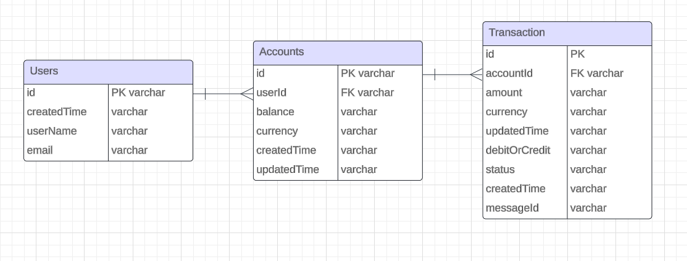

## Feature Statement:
Develop a robust adn scalable real-time transaction service 
that enable users to securely load funds to their account and authorize 
transactions based on their current balances. The system must support real-time balance updates with currency exchange
and maintain a high level of availability and reliability. The system will build base on **AWS SAM** by using AWS Lambda,
CDK, APIGateWay, CloudWatch, CLI, IAM, and RDS(MySQL).

## Problem Statement:
Current's core banking engine requires a real-time transaction service that can handle
two types of transactions:
1) Loads: Add money to a user with different currency (credit)
2) Authorizations: Conditionally remove money from a user with different currency (debit)

## Detail Design:
### Database Design:



#### User
* id: (PK, VARCHAR): Uniquely identifies a user
* username: (VARCHAR): User's username
* email: (VARCHAR): User's email
* createTime: (VARCHAR): Unix Timestamp the user was created
* updatedTime: (VARCHAR): Unix Timestamp update with the user profile
* PASSWORD: (VARCHAR): User's password

#### Account
* id (PK, VARCHAR): Uniquely identifies an account
* userId (FK, VARCHAR): User's id
* balance (VARCHAR): Account balance
* createTime (VARCHAR): Unix Timestamp the account was created
* updateTime (VARCHAR): Unix Timestamp the account was last updated
* currency (VARCHAR): The currency of the account balances.

#### Transaction
* id: (PK, VARCHAR): Uniquely identifies a transaction
* accountId (FK, VARCHAR): Account's id
* messageId (VARCHAR): UUID of message Id
* amount (VARCHAR): The amount of the transaction
* currency (VARCHAR): The currency of the transaction
* entryStatus (VARCHAR) : Debit or Credit
* createTime (VARCHAR): Unix Timestamp of the transaction was created
* updateTime (VARCHAR): Unix Timestamp of the transaction was last updated
* status (VARCHAR): The status of the transaction (PENDING, APPROVED, DECLINED)

### API Design:
#### PUT /api/load/{messageId}
* Parameters: 'messageId'
* Request Body:

```json
{
  "messageId": "string",
  "userId": "string",
  "transactionAmount": {
    "amount": "string",
    "currency": "string",
    "debitOrCredit": "string"
  }
}
```
example:
```json 
{
  "messageId": "50e70c62-e480-49fc-bc1b-e991ac672173",
  "userId": "8786e2f9-d472-46a8-958f-d659880e723d",
  "transactionAmount": {
      "amount": "100.23",
      "currency": "USD",
      "debitOrCredit": "CREDIT"
  }
}
```

* Response Body:

```json
 
{
  "ActionResponseStatus": "String",
 "data": {
  "messageId": "string",
  "userId": "string",
  "balance": {
    "amount": "string",
    "currency": "string",
    "debitOrCredit": "string"
  }
},
  "errorMessage": "String",
  "ActionName": "String"
}
```
example: 
```json
{
"ActionResponseStatus": "OK",
"data": {
  "messageId": "55210c62-e480-asdf-bc1b-e991ac67FSAC",
  "userId": "2226e2f9-ih09-46a8-958f-d659880asdfD",
  "responseCode": "APPROVED",
  "balance": {
    "amount": "100.23",
    "currency": "USD",
    "debitOrCredit": "CREDIT"
  }
},
  "errorMessage": "",
  "ActionName": "CreateLoadTransactionAction"
}
```

#### PUT /api/authorize/{messageId}

* Parameters: 'messageId'
* Request Body:
    
    ```json
    {
    "messageId": "string",
    "userId": "string",
  "responseCode": "string",
    "transactionAmount": {
        "amount": "string",
        "currency": "string",
        "debitOrCredit": "string"
    }
    }
    ```
  example: 
  ```json
    {
    "messageId": "50e70c62-e480-49fc-bc1b-e991ac672173",
    "userId": "8786e2f9-d472-46a8-958f-d659880e723d",
    "responseCode": "APPROVED",
    "transactionAmount": {
        "amount": "0",
        "currency": "USD",
        "debitOrCredit": "CREDIT"
    }
    }
    ```

* Response Body:
    ```json
    {
  "ActionResponseStatus": "String",
   "data":{ 
  "messageId": "string",
    "userId": "string",
  "responseCode": "string",
    "transactionAmount": {
        "amount": "string",
        "currency": "string",
        "debitOrCredit": "string"
      }
  },
  "errorMessage": "String",
    "ActionName": "String"
   }
    ```
  
  example:
  ```json
  {
  "ActionResponseStatus": "OK",
   "data":{ "messageId": "50e70c62-e480-49fc-bc1b-e991ac672173",
    "userId": "8786e2f9-d472-46a8-958f-d659880e723d",
    "responseCode": "APPROVED",
      "transactionAmount": {
        "amount": "0",
        "currency": "USD",
        "debitOrCredit": "DEBIT"
    }},
    "errorMessage": "",
    "ActionName": "CreateAuthorizationTransactionAction"
  }
  ```

### Open Question

