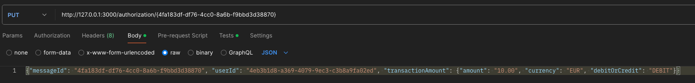

**Important: Don't forget to update the [Candidate README](#candidate-readme) section**

Real-time Transaction Challenge
===============================
## Overview
Welcome to Current's take-home technical assessment for backend engineers! We appreciate you taking the time to complete this, and we're excited to see what you come up with.

Today, you will be building a small but critical component of Current's core banking enging: real-time balance calculation through [event-sourcing](https://martinfowler.com/eaaDev/EventSourcing.html).

## Schema
The [included service.yml](service.yml) is the OpenAPI 3.0 schema to a service we would like you to create and host. 

## Details
The service accepts two types of transactions:
1) Loads: Add money to a user (credit)

2) Authorizations: Conditionally remove money from a user (debit)

Every load or authorization PUT should return the updated balance following the transaction. Authorization declines should be saved, even if they do not impact balance calculation.

You may use any technologies to support the service. We do not expect you to use a persistent store (you can you in-memory object), but you can if you want. We should be able to bootstrap your project locally to test.

## Expectations
We are looking for attention in the following areas:
1) Do you accept all requests supported by the schema, in the format described?

2) Do your responses conform to the prescribed schema?

3) Does the authorizations endpoint work as documented in the schema?

4) Do you have unit and integrations test on the functionality?

# Candidate README
## Bootstrap instructions

### Pre-requisites
* Docker installed
* Mysql installed 
* clone the repository
<br> `git clone https://github.com/codescreen/CodeScreen_9hlefyhj.git`
* Maven installed
<br> `brew install maven`
* [AWS SAM Prerequisites](https://docs.aws.amazon.com/serverless-application-model/latest/developerguide/prerequisites.html)
* [AWS SAM CLI installed](https://docs.aws.amazon.com/serverless-application-model/latest/developerguide/install-sam-cli.html)

### Database setup
* Login to you local database with using Mysql
<br>`mysql -h localhost -u root -p`
* Create a database
<br> `CREATE DATABASE CurrentInterviewDB;`
* Synchronize the schema 
<br> There's two ways to do so. You can try both way
1. Manually implement data
* Copy and paste the schemas' file in 
<br>`~/<your-root>/CodeScreen_9hlefyhj/TransactionService/TransactionServiceLambda/src/main/java/dev/codescreen/library/queries/MysqlSchema`
<br> copy and paste to the sql terminal or using `SOURCE` command
2. [Skeema.io Schema management tool](https://www.skeema.io/docs/examples/)
* [Install skeema.io](https://www.skeema.io/cli/download/)
* initialize the skeema
<br> `skeema init -h localhost -u root -p`
after that it should generate a `.skeema` folder in the root directory
* Put corresponding schemas (`User.sql, Account.sql, and Transaction.sql`) into the corresponding database's folder
* Diff and Push the schema
<br> `skeema diff -p`
<br> `skeema push -p`
* Facilitate the database with the data (`DBTestExmaple.sql`)
* modify the required environment variables in the `service.yml` file in the `TransactionService` folder


### Project setup
* `cd` to the lambda folder (Reminder: Do not run mvn under the CodeScreen folder)
<br> `cd ~/<your-root>/CodeScreen_9hlefyhj/TransactionService/TransactionServiceLambda/`
* Build the project
<br> `mvn clean install package`
* Starting docker container
### Lambda function local testing
* Start AWS local API
<br>`sam local start-api`
##### <br> Output should be look like this
<br>
* You can test the API endpoint with the following curl command or using Postman

1. `http://<your-local-ip>/ping`
* CURL 
<br> `curl GET http://<your-local-ip>/ping`

* POSTMAN
<br> 
2. `http://<your-local-ip>/authorization/{messageId}`
* CRUL
<br> `CRUL PUT http://<your-local-ip>/authorization/{messageId} -d '{"messageId": "string","userId": "string","transactionAmount": {"amount": "string","currency": "string","debitOrCredit": "string"}}`
* POSTMAN
<br> 
3. `http://<your-local-ip>/load/{messageId}`
* CRUL 
<br> `CRUL PUT http://<your-local-ip>/load/{messageId} -d '{"messageId": "string","userId": "string","transactionAmount": {"amount": "string","currency": "string","debitOrCredit": "string"}}`
*POSTMAN
<br> 

## Design considerations
* Here's my design considerations:
[DesignDoc.md](DesignDoc.md)
## Bonus: Deployment considerations
*Replace this: If I were to deploy this, I would host it in this way with these technologies.*

## ASCII art
*Optional but suggested, replace this:*
```
                                                                                
                   @@@@@@@@@@@@@@                                               
               @@@@@@@@@@@@@@@@@@@@@                                            
             @@@@@@@@@@@@@@@@@@@@@@@@@@                                         
          @@@@@@@@@@@@@@@@@@@@@@@@                                  @@@@        
        @@@@@@@@@@@@@@@@@@@@@      @@@@@@                        @@@@@@@@@      
     @@@@@@@@@@@@@@@@@@@@@    @@@@@@@@@@@@@@@                 .@@@@@@@@@@@@@@   
   @@@@@@@@@@@@@@@@@@@@   @@@@@@@@@@@@@@@@@@@@@           @@@@@@@@@@@@@@@@@@@@@ 
 @@@@@@@@@@@@@@@@@@@    @@@@@@@@@@@@@@@@@@@@@@@@@@   @@@@@@@@@@@@@@@@@@@@@@@@@@ 
    @@@@@@@@@@@@@@               @@@@@@@@@@@@@@@@@@@    @@@@@@@@@@@@@@@@@@@@    
      @@@@@@@@@@                     @@@@@@@@@@@@@@@@@@    @@@@@@@@@@@@@@       
         @@@@                          @@@@@@@@@@@@@@@@@@@@                     
                                          @@@@@@@@@@@@@@@@@@@@@@@@@@@@@         
                                            @@@@@@@@@@@@@@@@@@@@@@@@            
                                               @@@@@@@@@@@@@@@@@@               
                                                    @@@@@@@@                    
```
## License

At CodeScreen, we strongly value the integrity and privacy of our assessments. As a result, this repository is under exclusive copyright, which means you **do not** have permission to share your solution to this test publicly (i.e., inside a public GitHub/GitLab repo, on Reddit, etc.). <br>

## Submitting your solution

Please push your changes to the `main branch` of this repository. You can push one or more commits. <br>

Once you are finished with the task, please click the `Submit Solution` link on <a href="https://app.codescreen.com/candidate/003a68f9-09da-4e25-8f14-11e01011292a" target="_blank">this screen</a>.