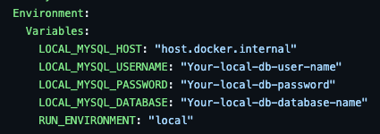
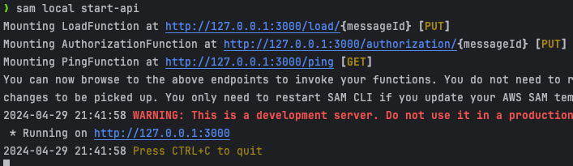
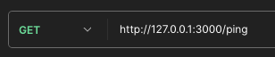
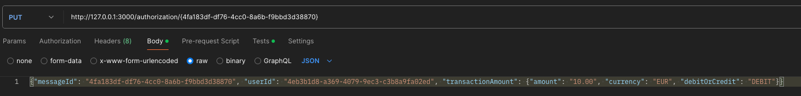
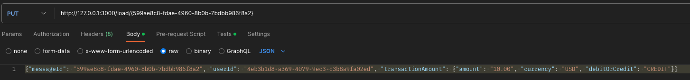

**Important: Don't forget to update the [Candidate README](#candidate-readme) section**

Real-time Transaction Challenge
===============================
## Overview
Welcome to Current's take-home technical assessment for backend engineers! We appreciate you taking the time to complete this, and we're excited to see what you come up with.

Today, you will be building a small but critical component of Current's core banking enging: real-time balance calculation through [event-sourcing](https://martinfowler.com/eaaDev/EventSourcing.html).

## Schema
The [included service.yml](service.yml) is the OpenAPI 3.0 schema to a service we would like you to create and host. 

## Details
The service accepts two types of transactions:
1) Loads: Add money to a user (credit)

2) Authorizations: Conditionally remove money from a user (debit)

Every load or authorization PUT should return the updated balance following the transaction. Authorization declines should be saved, even if they do not impact balance calculation.

You may use any technologies to support the service. We do not expect you to use a persistent store (you can you in-memory object), but you can if you want. We should be able to bootstrap your project locally to test.

## Expectations
We are looking for attention in the following areas:
1) Do you accept all requests supported by the schema, in the format described?

2) Do your responses conform to the prescribed schema?

3) Does the authorizations endpoint work as documented in the schema?

4) Do you have unit and integrations test on the functionality?

# Candidate README
## Bootstrap instructions

### Pre-requisites
* [Docker installed](https://www.docker.com/get-started/)
* [Mysql installed ](https://dev.mysql.com/downloads/mysql/)
* clone the repository
<br> `git clone https://github.com/codescreen/CodeScreen_9hlefyhj.git`
* Maven installed
<br> `brew install maven`
* [AWS SAM Prerequisites](https://docs.aws.amazon.com/serverless-application-model/latest/developerguide/prerequisites.html)
* [AWS SAM CLI installed](https://docs.aws.amazon.com/serverless-application-model/latest/developerguide/install-sam-cli.html)

### Database setup
1. Login to you local database with using Mysql
<br>`mysql -h localhost -u root -p`
2. Create a database
<br> `CREATE DATABASE CurrentInterviewDB;`
3. Synchronize the schema 
<br> There's two ways to do so. You can try both way
4. Manually implement data 
- 4.1 Copy and paste the schemas' file in 
<br>`~/<your-root>/CodeScreen_9hlefyhj/DatabaseSchema/MysqlSchema`
<br> copy and paste to the sql terminal or using `SOURCE` command
5. [Skeema.io Schema management tool](https://www.skeema.io/docs/examples/)
- 5.1 [Install skeema.io](https://www.skeema.io/cli/download/)
- 5.2 initialize the skeema
<br> `skeema init -h localhost -u root -p`
after that it should generate a `.skeema` folder in the root directory
- 5.3 Put corresponding schemas (`User.sql, Account.sql, and Transaction.sql`) into the corresponding database's folder
- 5.4 Diff and Push the schema
<br> `skeema diff -p`
<br> `skeema push -p`
- 5.5 Facilitate the database with the data (`DBTestExmaple.sql`)
- 5.6 modify the required environment variables in the `service.yml` file in the `TransactionService` folder


### Project setup
1. Facilitate database with Mysql in `~/<your-root-folder>/CodeScreen_9hlefyhj/DatabaseSchema/MysqlSchema/DBTestExample.sql`
2. `cd` to the lambda folder (Reminder: Do not run mvn under the CodeScreen's folder)
<br> `cd ~/<your-root>/CodeScreen_9hlefyhj/TransactionServiceLambda/`
3. Modify the environment variables in the `service.yml` file
<br> 
4. Build the project
<br> `mvn clean install package`
5. Starting docker container
### Lambda function local testing
1. Start AWS local API
<br>`sam local start-api`
 <br>Output should be look like this
<br>
* You can test the API endpoint with the following curl command or using Postman

1. `http://<your-local-ip>/ping`
* CURL 
<br> `curl -X GET http://<your-local-ip>/ping`

* POSTMAN
<br> 
2. `http://<your-local-ip>/authorization/{messageId}`
* CRUL
<br> `CRUL -X PUT http://<your-local-ip>/authorization/{messageId} -d '{"messageId": "string","userId": "string","transactionAmount": {"amount": "string","currency": "string","debitOrCredit": "string"}}`
* POSTMAN
<br> 
3. `http://<your-local-ip>/load/{messageId}`
* CRUL 
<br> `CRUL -X PUT http://<your-local-ip>/load/{messageId} -d '{"messageId": "string","userId": "string","transactionAmount": {"amount": "string","currency": "string","debitOrCredit": "string"}}`
* POSTMAN
<br> 

### Test Case

#### Here's some test cases for you  

* Load (Same Currency)

```json
{"messageId": "3397afd2-90e8-49c0-8268-acec071d7117", "userId": "4eb3b1d8-a369-4079-9ec3-c3b8a9fa02ed", "transactionAmount": {"amount": "10000.00", "currency": "USD", "debitOrCredit": "CREDIT"}}
```

* Load (Different Currency)

```json
{"messageId": "83fe04a0-79fe-4e95-b840-e20d7a281d6e", "userId": "4eb3b1d8-a36  9-4079-9ec3-c3b8a9fa02ed", "transactionAmount": {"amount": "10000.00", "currency": "EUR", "debitOrCredit": "CREDIT"}}
```

* Authorization (Same Currency)

```json
{"messageId": "50e70c62-e480-49fc-bc1b-e991ac672173", "userId": "4eb3b1d8-a369-4079-9ec3-c3b8a9fa02ed", "transactionAmount": {"amount": "100.00", "currency": "USD", "debitOrCredit": "DEBIT"}}

```

* Authorization (Different Currency)

```json
{"messageId": "4f9c8417-c8b8-4333-a1f1-c9bc9d3d13cd", "userId": "4eb3b1d8-a369-4079-9ec3-c3b8a9fa02ed", "transactionAmount": {"amount": "100.00", "currency": "EUR", "debitOrCredit": "DEBIT"}}
```


## Design considerations
* Here's my design considerations:
[DesignDoc.md](DesignDoc.md)
## Bonus: Deployment considerations

### Overview

Our deployment plan leverages AWS services to create a scalable, reliable, and secure transaction processing system. 
The architecture includes AWS Lambda, Amazon RDS (Mysql), API Gateway, AWS CodePipeline, and additional AWS services for caching and messaging to ensure performance and scalability.

### Infrastructure as Code (IaC) with AWS CDK:
We use AWS Cloud Development Kit (AWS CDK) to define and provision our AWS infrastructure programmatically. 
This approach ensures that our infrastructure configurations are reproducible, version-controlled, and transparent. 

### API Management with Amazon API Gateway:

API Gateway manages traffic, authorizes API calls, and monitors interactions. 
It supports canary release deployments to gradually introduce changes in the production environment.

#### Pipeline Stages:
* **Synth**: Generates CloudFormation templates from CDK definitions.
* **Build**: Compiles code, runs unit tests, and packages the application.
* **Beta**: Deploys to a staging environment where integration tests are conducted via API Gateway.
* **Prod**: Deploys the validated build to the production environment after approval.

### Database Configuration with Amazon RDS (MySQL):

Amazon RDS is used to host relational data. 
We configure RDS for high availability and enable features such as automated backups, multi-AZ deployments, and performance insights for monitoring.

* Security: Database access is restricted to Lambda functions via IAM roles and secured within a VPC. Connection pooling is implemented to enhance performance.

###  Performance Optimization:
To address potential latency issues related to real-time currency exchange rate fetching (Java Money API), 
we incorporate AWS ElastiCache and/or messaging systems like AWS SQS or Apache Kafka.

* **Caching with ElastiCache**: Temporarily stores frequently accessed data, such as currency exchange rates, reducing latency and API call overhead.
* **Messaging with SQS/Kafka**: Manages transaction order and integrity during high-volume periods, ensuring system scalability and resilience.

### Monitoring, Logging, and Compliance with AWS CloudWatch and AWS CloudTrail:

* **Monitoring**: AWS CloudWatch monitors and alerts on application and infrastructure performance metrics. Custom metrics and dashboards are configured for real-time visibility.
* **Logging**: AWS CloudTrail tracks user activity and API usage. Logs are integral for auditing and post-incident analysis.
* **Compliance**: Ensures all components comply with regulatory standards, utilizing AWS’s compliance capabilities.

### Security and Access Control:

* **IAM**: Manages access to AWS resources. Policies are defined to adhere to the principle of least privilege.
* **VPC**: Isolates network environments. API Gateway and Lambda functions interact within private subnets to enhance security.
## ASCII art
*Optional but suggested, replace this:*
```
                                                                                
                   @@@@@@@@@@@@@@                                               
               @@@@@@@@@@@@@@@@@@@@@                                            
             @@@@@@@@@@@@@@@@@@@@@@@@@@                                         
          @@@@@@@@@@@@@@@@@@@@@@@@                                  @@@@        
        @@@@@@@@@@@@@@@@@@@@@      @@@@@@                        @@@@@@@@@      
     @@@@@@@@@@@@@@@@@@@@@    @@@@@@@@@@@@@@@                 .@@@@@@@@@@@@@@   
   @@@@@@@@@@@@@@@@@@@@   @@@@@@@@@@@@@@@@@@@@@           @@@@@@@@@@@@@@@@@@@@@ 
 @@@@@@@@@@@@@@@@@@@    @@@@@@@@@@@@@@@@@@@@@@@@@@   @@@@@@@@@@@@@@@@@@@@@@@@@@ 
    @@@@@@@@@@@@@@               @@@@@@@@@@@@@@@@@@@    @@@@@@@@@@@@@@@@@@@@    
      @@@@@@@@@@                     @@@@@@@@@@@@@@@@@@    @@@@@@@@@@@@@@       
         @@@@                          @@@@@@@@@@@@@@@@@@@@                     
                                          @@@@@@@@@@@@@@@@@@@@@@@@@@@@@         
                                            @@@@@@@@@@@@@@@@@@@@@@@@            
                                               @@@@@@@@@@@@@@@@@@               
                                                    @@@@@@@@                    
```
## License

At CodeScreen, we strongly value the integrity and privacy of our assessments. As a result, this repository is under exclusive copyright, which means you **do not** have permission to share your solution to this test publicly (i.e., inside a public GitHub/GitLab repo, on Reddit, etc.). <br>

## Submitting your solution

Please push your changes to the `main branch` of this repository. You can push one or more commits. <br>

Once you are finished with the task, please click the `Submit Solution` link on <a href="https://app.codescreen.com/candidate/003a68f9-09da-4e25-8f14-11e01011292a" target="_blank">this screen</a>.